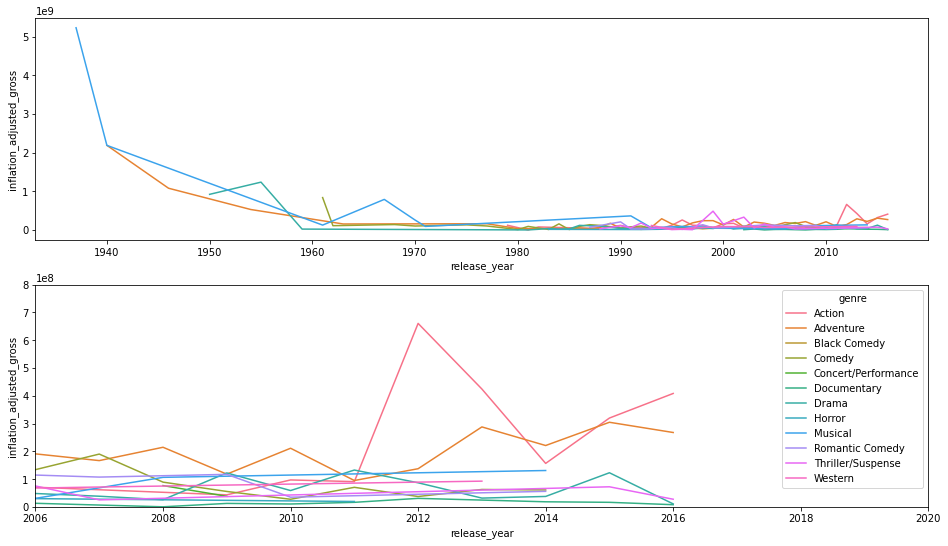

# What contributes to the success of Disney movies?


### - Goal: Analyze movies produced by Disney to figure out the relationship between Disney movies and Box Office Success
- These questions of interest will be answered below by building a linear regression model and computing confidence intervals for regression parameters:
    1. Top 10 Movies in the Box Office?
    2. Movie Genre Popularity Trend?
    3. Relationship Between Genre and Box Office Gross?

### - Data: [Disney data](https://data.world/kgarrett/disney-character-success-00-16) compiled by Kelly Garrett
- The data contains 579 Disney movies with 6 features: movie title, release date, genre, MPAA rating, total gross, and inflation-adjusted gross.

### - Python Libraries Used
- pandas, numpy, sklearn, seaborn, matplotlib

### - File Descriptions
- datasets/disney_movies_total_gross.csv: the dataset described above
- Disney-Movies-and-Box-Office-Success.ipynb: Jupyter Notebook used for the Disney movies analysis

### - Acknowledgement
- [DataCamp](https://www.datacamp.com/)

### - Table of Contents
1. [Exploratory Data Analysis](#exploratory-data-analysis)
2. [Data Preprocessing and Feature Engineering](#data-preprocessing-and-feature-engineering)
  - 2.1 [Missing Values](#missing-values)
  - 2.2 [Feature Engineering](#feature-engineering)
3. [Modeling and Evaluation](#modeling-and-evaluation)
  - 3.1 [Top 10 Movies in the Box Office](#top-10-movies-in-the-box-office)
  - 3.2 [Movie Genre Popularity Trend](#movie-genre-popularity-trend)
  - 3.3 [Relationship Between Genre and Box Office Gross](#relationship-between-genre-and-box-office-gross)
      - 3.3.1 [Linear Regression](#linear-regression)
      - 3.3.2 [Confidence Intervals](#confidence-intervals)

## Exploratory Data Analysis


```python
# Import pandas library
import pandas as pd

# Read the file into gross
gross = pd.read_csv('datasets/disney_movies_total_gross.csv', parse_dates = ['release_date'])

# Print out gross
gross.head()
```


<div>
<!--  
<style scoped>
    .dataframe tbody tr th:only-of-type {
        vertical-align: middle;
    }

    .dataframe tbody tr th {
        vertical-align: top;
    }

    .dataframe thead th {
        text-align: right;
    }
</style>
-->
<table border="1" class="dataframe">
  <thead>
    <tr style="text-align: right;">
      <th></th>
      <th>movie_title</th>
      <th>release_date</th>
      <th>genre</th>
      <th>mpaa_rating</th>
      <th>total_gross</th>
      <th>inflation_adjusted_gross</th>
    </tr>
  </thead>
  <tbody>
    <tr>
      <th>0</th>
      <td>Snow White and the Seven Dwarfs</td>
      <td>1937-12-21</td>
      <td>Musical</td>
      <td>G</td>
      <td>184925485</td>
      <td>5228953251</td>
    </tr>
    <tr>
      <th>1</th>
      <td>Pinocchio</td>
      <td>1940-02-09</td>
      <td>Adventure</td>
      <td>G</td>
      <td>84300000</td>
      <td>2188229052</td>
    </tr>
    <tr>
      <th>2</th>
      <td>Fantasia</td>
      <td>1940-11-13</td>
      <td>Musical</td>
      <td>G</td>
      <td>83320000</td>
      <td>2187090808</td>
    </tr>
    <tr>
      <th>3</th>
      <td>Song of the South</td>
      <td>1946-11-12</td>
      <td>Adventure</td>
      <td>G</td>
      <td>65000000</td>
      <td>1078510579</td>
    </tr>
    <tr>
      <th>4</th>
      <td>Cinderella</td>
      <td>1950-02-15</td>
      <td>Drama</td>
      <td>G</td>
      <td>85000000</td>
      <td>920608730</td>
    </tr>
  </tbody>
</table>
</div>


```python
# Print summary statistics
gross_description = gross.describe()
print(gross_description)

print('\n')

# Print DataFrame information
gross_info = gross.info()
print(gross_info)
```

            total_gross  inflation_adjusted_gross
    count  5.790000e+02              5.790000e+02
    mean   6.470179e+07              1.187625e+08
    std    9.301301e+07              2.860853e+08
    min    0.000000e+00              0.000000e+00
    25%    1.278886e+07              2.274123e+07
    50%    3.070245e+07              5.515978e+07
    75%    7.570903e+07              1.192020e+08
    max    9.366622e+08              5.228953e+09
    
    
    <class 'pandas.core.frame.DataFrame'>
    RangeIndex: 579 entries, 0 to 578
    Data columns (total 6 columns):
     #   Column                    Non-Null Count  Dtype         
    ---  ------                    --------------  -----         
     0   movie_title               579 non-null    object        
     1   release_date              579 non-null    datetime64[ns]
     2   genre                     562 non-null    object        
     3   mpaa_rating               523 non-null    object        
     4   total_gross               579 non-null    int64         
     5   inflation_adjusted_gross  579 non-null    int64         
    dtypes: datetime64[ns](1), int64(2), object(3)
    memory usage: 27.3+ KB
    None


- The dataset has missing values in 'genre' and 'mpaa_rating' columns. 

## Data Preprocessing and Feature Engineering
### Missing Values
- I will replace the missing values in the 'genre' column using the genre information from [IMDb website](https://www.imdb.com) (note that the 'mpaa_rating' column is not related to the questions of interest).
- If more than one genre is shown on the IMDb website, I will select the most frequent genre in the dataset from among those genres.


```python
# Counts of unique values in the 'genre' column
gross['genre'].value_counts()
```


    Comedy                 182
    Adventure              129
    Drama                  114
    Action                  40
    Thriller/Suspense       24
    Romantic Comedy         23
    Musical                 16
    Documentary             16
    Western                  7
    Horror                   6
    Black Comedy             3
    Concert/Performance      2
    Name: genre, dtype: int64


```python
# Inspect the 17 missing values in the 'genre' column
gross.loc[gross['genre'].isnull()]
```


<div>
<!--
<style scoped>
    .dataframe tbody tr th:only-of-type {
        vertical-align: middle;
    }

    .dataframe tbody tr th {
        vertical-align: top;
    }

    .dataframe thead th {
        text-align: right;
    }
</style>
-->
<table border="1" class="dataframe">
  <thead>
    <tr style="text-align: right;">
      <th></th>
      <th>movie_title</th>
      <th>release_date</th>
      <th>genre</th>
      <th>mpaa_rating</th>
      <th>total_gross</th>
      <th>inflation_adjusted_gross</th>
    </tr>
  </thead>
  <tbody>
    <tr>
      <th>20</th>
      <td>The Many Adventures of Winnie the Pooh</td>
      <td>1977-03-11</td>
      <td>NaN</td>
      <td>NaN</td>
      <td>0</td>
      <td>0</td>
    </tr>
    <tr>
      <th>22</th>
      <td>Herbie Goes to Monte Carlo</td>
      <td>1977-06-24</td>
      <td>NaN</td>
      <td>NaN</td>
      <td>28000000</td>
      <td>105847527</td>
    </tr>
    <tr>
      <th>23</th>
      <td>The Black Hole</td>
      <td>1979-12-21</td>
      <td>NaN</td>
      <td>NaN</td>
      <td>35841901</td>
      <td>120377374</td>
    </tr>
    <tr>
      <th>24</th>
      <td>Midnight Madness</td>
      <td>1980-02-08</td>
      <td>NaN</td>
      <td>NaN</td>
      <td>2900000</td>
      <td>9088096</td>
    </tr>
    <tr>
      <th>25</th>
      <td>The Last Flight of Noah’s Ark</td>
      <td>1980-06-25</td>
      <td>NaN</td>
      <td>NaN</td>
      <td>11000000</td>
      <td>34472116</td>
    </tr>
    <tr>
      <th>26</th>
      <td>The Devil and Max Devlin</td>
      <td>1981-01-01</td>
      <td>NaN</td>
      <td>NaN</td>
      <td>16000000</td>
      <td>48517980</td>
    </tr>
    <tr>
      <th>121</th>
      <td>Newsies</td>
      <td>1992-04-08</td>
      <td>NaN</td>
      <td>PG</td>
      <td>2706352</td>
      <td>5497481</td>
    </tr>
    <tr>
      <th>122</th>
      <td>Passed Away</td>
      <td>1992-04-24</td>
      <td>NaN</td>
      <td>PG-13</td>
      <td>4030793</td>
      <td>8187848</td>
    </tr>
    <tr>
      <th>128</th>
      <td>A Gun in Betty Lou's Handbag</td>
      <td>1992-08-21</td>
      <td>NaN</td>
      <td>PG-13</td>
      <td>3591460</td>
      <td>7295423</td>
    </tr>
    <tr>
      <th>146</th>
      <td>Bound by Honor</td>
      <td>1993-04-16</td>
      <td>NaN</td>
      <td>R</td>
      <td>4496583</td>
      <td>9156084</td>
    </tr>
    <tr>
      <th>155</th>
      <td>My Boyfriend's Back</td>
      <td>1993-08-06</td>
      <td>NaN</td>
      <td>PG-13</td>
      <td>3218882</td>
      <td>6554384</td>
    </tr>
    <tr>
      <th>156</th>
      <td>Father Hood</td>
      <td>1993-08-27</td>
      <td>NaN</td>
      <td>PG-13</td>
      <td>3268203</td>
      <td>6654819</td>
    </tr>
    <tr>
      <th>168</th>
      <td>Red Rock West</td>
      <td>1994-01-28</td>
      <td>NaN</td>
      <td>R</td>
      <td>2502551</td>
      <td>5170709</td>
    </tr>
    <tr>
      <th>251</th>
      <td>The War at Home</td>
      <td>1996-11-20</td>
      <td>NaN</td>
      <td>R</td>
      <td>34368</td>
      <td>65543</td>
    </tr>
    <tr>
      <th>304</th>
      <td>Endurance</td>
      <td>1999-05-14</td>
      <td>NaN</td>
      <td>PG</td>
      <td>229128</td>
      <td>380218</td>
    </tr>
    <tr>
      <th>350</th>
      <td>High Heels and Low Lifes</td>
      <td>2001-10-26</td>
      <td>NaN</td>
      <td>R</td>
      <td>226792</td>
      <td>337782</td>
    </tr>
    <tr>
      <th>355</th>
      <td>Frank McKlusky C.I.</td>
      <td>2002-01-01</td>
      <td>NaN</td>
      <td>NaN</td>
      <td>0</td>
      <td>0</td>
    </tr>
  </tbody>
</table>
</div>


- Since 'The Many Adventures of Winnie the Pooh' and 'Frank McKlusky C.I.' only have release date information, I will delete those two rows.


```python
# Delete two movies which only have release date information and reset indices
gross.drop([20, 355], axis = 0, inplace = True)
gross.reset_index(drop = True, inplace = True)
```


```python
# Impute the remaining 15 missing values using the IMDb website
gross.loc[gross['movie_title'] == 'Herbie Goes to Monte Carlo', 'genre'] = 'Comedy'
gross.loc[gross['movie_title'] == 'The Black Hole', 'genre'] = 'Action'
gross.loc[gross['movie_title'] == 'Midnight Madness', 'genre'] = 'Comedy'
gross.loc[gross['movie_title'] == 'The Last Flight of Noah’s Ark', 'genre'] = 'Adventure'
gross.loc[gross['movie_title'] == 'The Devil and Max Devlin', 'genre'] = 'Comedy'
gross.loc[gross['movie_title'] == 'Newsies', 'genre'] = 'Drama'
gross.loc[gross['movie_title'] == 'Passed Away', 'genre'] = 'Comedy'
gross.loc[gross['movie_title'] == "A Gun in Betty Lou's Handbag", 'genre'] = 'Comedy'
gross.loc[gross['movie_title'] == 'Bound by Honor', 'genre'] = 'Drama'
gross.loc[gross['movie_title'] == "My Boyfriend's Back", 'genre'] = 'Comedy'
gross.loc[gross['movie_title'] == 'Father Hood', 'genre'] = 'Comedy'
gross.loc[gross['movie_title'] == 'Red Rock West', 'genre'] = 'Drama'
gross.loc[gross['movie_title'] == 'The War at Home', 'genre'] = 'Comedy'
gross.loc[gross['movie_title'] == 'Endurance', 'genre'] = 'Drama'
gross.loc[gross['movie_title'] == 'High Heels and Low Lifes', 'genre'] = 'Comedy'
```


```python
# Count the number of NaNs in the 'genre' column to verify
gross['genre'].isnull().sum()
```


    0


### Feature Engineering
- I will build a linear regression model to understand the relationship between genre and box office gross.
- To do so, I will use one-hot encoding to convert the categorical variable (genre) to numerical variables. 
- There will be 11 dummy variables, one for each genre except the action genre which I will use as a baseline. For example,
    - The Lion King (adventure): the adventure variable will be 1 and other dummy variables will be 0.
    - The Avengers (action): all dummy variables will be 0.


```python
# Convert genre variable to dummy variables
genre_dummies = pd.get_dummies(data = gross['genre'], drop_first = True)

# Inspect genre_dummies
genre_dummies.head()
```


<div>
<!--
<style scoped>
    .dataframe tbody tr th:only-of-type {
        vertical-align: middle;
    }

    .dataframe tbody tr th {
        vertical-align: top;
    }

    .dataframe thead th {
        text-align: right;
    }
</style>
-->
<table border="1" class="dataframe">
  <thead>
    <tr style="text-align: right;">
      <th></th>
      <th>Adventure</th>
      <th>Black Comedy</th>
      <th>Comedy</th>
      <th>Concert/Performance</th>
      <th>Documentary</th>
      <th>Drama</th>
      <th>Horror</th>
      <th>Musical</th>
      <th>Romantic Comedy</th>
      <th>Thriller/Suspense</th>
      <th>Western</th>
    </tr>
  </thead>
  <tbody>
    <tr>
      <th>0</th>
      <td>0</td>
      <td>0</td>
      <td>0</td>
      <td>0</td>
      <td>0</td>
      <td>0</td>
      <td>0</td>
      <td>1</td>
      <td>0</td>
      <td>0</td>
      <td>0</td>
    </tr>
    <tr>
      <th>1</th>
      <td>1</td>
      <td>0</td>
      <td>0</td>
      <td>0</td>
      <td>0</td>
      <td>0</td>
      <td>0</td>
      <td>0</td>
      <td>0</td>
      <td>0</td>
      <td>0</td>
    </tr>
    <tr>
      <th>2</th>
      <td>0</td>
      <td>0</td>
      <td>0</td>
      <td>0</td>
      <td>0</td>
      <td>0</td>
      <td>0</td>
      <td>1</td>
      <td>0</td>
      <td>0</td>
      <td>0</td>
    </tr>
    <tr>
      <th>3</th>
      <td>1</td>
      <td>0</td>
      <td>0</td>
      <td>0</td>
      <td>0</td>
      <td>0</td>
      <td>0</td>
      <td>0</td>
      <td>0</td>
      <td>0</td>
      <td>0</td>
    </tr>
    <tr>
      <th>4</th>
      <td>0</td>
      <td>0</td>
      <td>0</td>
      <td>0</td>
      <td>0</td>
      <td>1</td>
      <td>0</td>
      <td>0</td>
      <td>0</td>
      <td>0</td>
      <td>0</td>
    </tr>
  </tbody>
</table>
</div>


## Modeling and Evaluation
### Top 10 Movies in the Box Office
- What are the 10 Disney movies that have earned the most at the box office?
    - I will sort movies by their inflation-adjusted gross.


```python
# Sort data by the adjusted gross in descending order
inflation_adjusted_gross_desc = gross.sort_values(by = 'inflation_adjusted_gross', ascending = False)

# Display the top 10 movies
inflation_adjusted_gross_desc.head(10)
```


<div>
<!--
<style scoped>
    .dataframe tbody tr th:only-of-type {
        vertical-align: middle;
    }

    .dataframe tbody tr th {
        vertical-align: top;
    }

    .dataframe thead th {
        text-align: right;
    }
</style>
-->
<table border="1" class="dataframe">
  <thead>
    <tr style="text-align: right;">
      <th></th>
      <th>movie_title</th>
      <th>release_date</th>
      <th>genre</th>
      <th>mpaa_rating</th>
      <th>total_gross</th>
      <th>inflation_adjusted_gross</th>
    </tr>
  </thead>
  <tbody>
    <tr>
      <th>0</th>
      <td>Snow White and the Seven Dwarfs</td>
      <td>1937-12-21</td>
      <td>Musical</td>
      <td>G</td>
      <td>184925485</td>
      <td>5228953251</td>
    </tr>
    <tr>
      <th>1</th>
      <td>Pinocchio</td>
      <td>1940-02-09</td>
      <td>Adventure</td>
      <td>G</td>
      <td>84300000</td>
      <td>2188229052</td>
    </tr>
    <tr>
      <th>2</th>
      <td>Fantasia</td>
      <td>1940-11-13</td>
      <td>Musical</td>
      <td>G</td>
      <td>83320000</td>
      <td>2187090808</td>
    </tr>
    <tr>
      <th>8</th>
      <td>101 Dalmatians</td>
      <td>1961-01-25</td>
      <td>Comedy</td>
      <td>G</td>
      <td>153000000</td>
      <td>1362870985</td>
    </tr>
    <tr>
      <th>6</th>
      <td>Lady and the Tramp</td>
      <td>1955-06-22</td>
      <td>Drama</td>
      <td>G</td>
      <td>93600000</td>
      <td>1236035515</td>
    </tr>
    <tr>
      <th>3</th>
      <td>Song of the South</td>
      <td>1946-11-12</td>
      <td>Adventure</td>
      <td>G</td>
      <td>65000000</td>
      <td>1078510579</td>
    </tr>
    <tr>
      <th>562</th>
      <td>Star Wars Ep. VII: The Force Awakens</td>
      <td>2015-12-18</td>
      <td>Adventure</td>
      <td>PG-13</td>
      <td>936662225</td>
      <td>936662225</td>
    </tr>
    <tr>
      <th>4</th>
      <td>Cinderella</td>
      <td>1950-02-15</td>
      <td>Drama</td>
      <td>G</td>
      <td>85000000</td>
      <td>920608730</td>
    </tr>
    <tr>
      <th>13</th>
      <td>The Jungle Book</td>
      <td>1967-10-18</td>
      <td>Musical</td>
      <td>Not Rated</td>
      <td>141843000</td>
      <td>789612346</td>
    </tr>
    <tr>
      <th>178</th>
      <td>The Lion King</td>
      <td>1994-06-15</td>
      <td>Adventure</td>
      <td>G</td>
      <td>422780140</td>
      <td>761640898</td>
    </tr>
  </tbody>
</table>
</div>


- Snow White and the Seven Dwarfs is the most successful movie to date!

### Movie Genre Popularity Trend
- Which genres are growing stronger in popularity?
    - I will group movies by genre and then by year to see the adjusted gross of each genre in each year.


```python
# Extract year from release_date and store it in a new column
gross['release_year'] = pd.DatetimeIndex(gross['release_date']).year

# Compute mean of adjusted gross per genre and per year
group = gross.groupby(['genre', 'release_year']).mean()

# Convert the GroupBy object to a DataFrame
genre_yearly = group.reset_index()

# Inspect genre_yearly
genre_yearly.head(10)
```


<div>
<!--
<style scoped>
    .dataframe tbody tr th:only-of-type {
        vertical-align: middle;
    }

    .dataframe tbody tr th {
        vertical-align: top;
    }

    .dataframe thead th {
        text-align: right;
    }
</style>
-->
<table border="1" class="dataframe">
  <thead>
    <tr style="text-align: right;">
      <th></th>
      <th>genre</th>
      <th>release_year</th>
      <th>total_gross</th>
      <th>inflation_adjusted_gross</th>
    </tr>
  </thead>
  <tbody>
    <tr>
      <th>0</th>
      <td>Action</td>
      <td>1979</td>
      <td>35841901.0</td>
      <td>120377374.0</td>
    </tr>
    <tr>
      <th>1</th>
      <td>Action</td>
      <td>1981</td>
      <td>0.0</td>
      <td>0.0</td>
    </tr>
    <tr>
      <th>2</th>
      <td>Action</td>
      <td>1982</td>
      <td>26918576.0</td>
      <td>77184895.0</td>
    </tr>
    <tr>
      <th>3</th>
      <td>Action</td>
      <td>1988</td>
      <td>17577696.0</td>
      <td>36053517.0</td>
    </tr>
    <tr>
      <th>4</th>
      <td>Action</td>
      <td>1990</td>
      <td>59249588.5</td>
      <td>118358772.0</td>
    </tr>
    <tr>
      <th>5</th>
      <td>Action</td>
      <td>1991</td>
      <td>28924936.5</td>
      <td>57918572.5</td>
    </tr>
    <tr>
      <th>6</th>
      <td>Action</td>
      <td>1992</td>
      <td>29028000.0</td>
      <td>58965304.0</td>
    </tr>
    <tr>
      <th>7</th>
      <td>Action</td>
      <td>1993</td>
      <td>21943553.5</td>
      <td>44682157.0</td>
    </tr>
    <tr>
      <th>8</th>
      <td>Action</td>
      <td>1994</td>
      <td>19180582.0</td>
      <td>39545796.0</td>
    </tr>
    <tr>
      <th>9</th>
      <td>Action</td>
      <td>1995</td>
      <td>63037553.5</td>
      <td>122162426.5</td>
    </tr>
  </tbody>
</table>
</div>


```python
# Import seaborn and matplotlib librararies
import seaborn as sns
import matplotlib.pyplot as plt

fig, ax = plt.subplots(2, figsize = (16, 9))

# Plot the data to see how have box office revenuew changed over time
p1 = sns.lineplot(x = 'release_year', y = 'inflation_adjusted_gross', hue = 'genre', data = genre_yearly, ax = ax[0], legend = False)

# Plot the recent data from 2006
p2 = sns.lineplot(x = 'release_year', y = 'inflation_adjusted_gross', hue = 'genre', data = genre_yearly, ax = ax[1])
p2.set(xlim = (2006, 2020))
p2.set(ylim = (0, 0.8e9))

plt.show()
```


    

    


- Action and Adventure genres are growing the fastest!

### Relationship Between Genre and Box Office Gross
#### Linear Regression
- Using the dummy variables generated in the feature engineering section, I will build a linear regression model to investigate the relationship between genre and box office gross.
- From the regression model, the effect of each genre can be checked by looking at its coefficient in units of box office gross dollars. 
- The intercept and the first coefficient values represent the effect of action and adventure genres, respectively.
    - Intercept: the intercept in a multiple regression model is the mean for the response when all of the explanatory variables take on the value 0.
    - Regression coefficients: the coefficient of a variable is interpreted as the change in the response based on a 1-unit change in the corresponding explanatory variable keeping all other variables held constant.
    - Reference: [Interpretation in Multiple Regression at Duke University](https://www2.stat.duke.edu/courses/Spring00/sta242/handouts/beesIII.pdf)


```python
# Import LinearRegression
from sklearn.linear_model import LinearRegression

# Build a linear regression model
regr = LinearRegression()

# Fit regr to the dataset
regr.fit(genre_dummies, gross['inflation_adjusted_gross'])

# Get estimated intercept and coefficient values
action = regr.intercept_
adventure = regr.coef_[[0]][0]

# Inspect the estimated intercept and coefficient values
print((action, adventure))
```

    (137056442.92682922, 52141543.79624728)


#### Confidence Intervals
- I will compute 90, 95, and 99% confidence intervals for regression parameters (i.e. the inctercept and coefficients) using the pairs bootstrap method. 
- For example, the 95% confidence intervals for the intercept $a$ and coefficient $b_i$ means that the intervals have a probability of 95% to contain the true value $a$ and coefficient $b_i$, respectively.
- If there is a significant relationship between a given genre and the adjusted gross, the confidence interval of its coefficient should exclude 0. 


```python
# Import numpy
import numpy as np

# Create an array of indices to sample from
inds = np.arange(0, len(gross['genre']))

# Initialize 500 replicate arrays
size = 500
bs_action_reps = np.empty(size)
bs_adventure_reps = np.empty(size)

# Generate replicates
for i in range(size):
    
    # Resample the indices
    bs_inds = np.random.choice(inds, size = len(inds))
    
    # Get the sampled genre and sampled adjusted gross
    bs_genre = gross['genre'][bs_inds] 
    bs_gross = gross['inflation_adjusted_gross'][bs_inds]
    
    # Convert sampled genre to dummy variables
    bs_dummies = pd.get_dummies(data = bs_genre, drop_first = True)
    
    # Build and fit a regression model
    regr = LinearRegression().fit(bs_dummies, bs_gross)
    
    # Compute replicates of estimated intercept and coefficient
    bs_action_reps[i] = regr.intercept_
    bs_adventure_reps[i] = regr.coef_[[0]][0]

# Compute 99% confidence intervals for intercept and coefficient values
confidence_interval_action = np.percentile(bs_action_reps, [0.5, 99.5])
confidence_interval_adventure = np.percentile(bs_adventure_reps, [0.5, 99.5])

# Inspect the confidence intervals
print('99% confidence intervals for action movies: ', confidence_interval_action)
print('99% confidence intervals for adventure movies: ', confidence_interval_adventure)    
    
# Compute 95% confidence intervals for intercept and coefficient values
confidence_interval_action = np.percentile(bs_action_reps, [2.5, 97.5])
confidence_interval_adventure = np.percentile(bs_adventure_reps, [2.5, 97.5])

# Inspect the confidence intervals
print('95% confidence intervals for action movies: ', confidence_interval_action)
print('95% confidence intervals for adventure movies: ', confidence_interval_adventure)

# Compute 90% confidence intervals for intercept and coefficient values
confidence_interval_action = np.percentile(bs_action_reps, [5, 95])
confidence_interval_adventure = np.percentile(bs_adventure_reps, [5, 95])

# Inspect the confidence intervals
print('90% confidence intervals for action movies: ', confidence_interval_action)
print('90% confidence intervals for adventure movies: ', confidence_interval_adventure)
```

    99% confidence intervals for action movies:  [8.09518042e+07 1.94339400e+08]
    99% confidence intervals for adventure movies:  [-3.23103814e+07  1.35099683e+08]
    95% confidence intervals for action movies:  [9.20401699e+07 1.83395103e+08]
    95% confidence intervals for adventure movies:  [-6.70112873e+06  1.19533001e+08]
    90% confidence intervals for action movies:  [9.83256036e+07 1.75677736e+08]
    90% confidence intervals for adventure movies:  [2.64681042e+06 1.07180420e+08]


- It is likely that the adjusted gross is significantly correlated with the action and adventure genres, because the confidence intervals from the bootstrap method do not contain the value zero (90, 95, 99% confidence intervals for action movies, 90% confidence intervals for adventure movies).
- From the results of the bootstrap analysis and the trend plot, I could say that Disney's action and adventure movies tend to do better in terms of adjusted gross than other genres. So we could expect more Marvel, Star Wars, and live-action movies in the upcomimng years!
- Disney should make more action and adventure movies!
